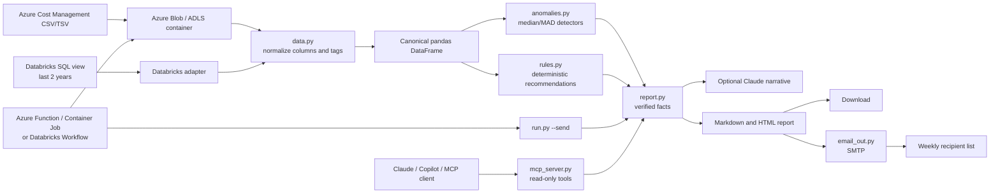

# FinOps Agent Architecture

## Purpose

The FinOps Agent turns Azure Cost Management exports into an explainable weekly
cost review. It identifies unusual spend, produces practical recommendations,
renders a report, and optionally delivers that report by email.

## High-level flow



## Components

- `app.py`: local Streamlit user interface. Handles upload, analysis, charts,
  downloads, and an explicit email action.
- `run.py`: non-interactive CLI for scheduled jobs and automation.
- `data.py`: maps Azure and FOCUS column names, reads UTF-8 or UTF-16 exports,
  parses tags, and preserves untagged spend.
- `anomalies.py`: detects spikes, sustained step changes, new resource groups,
  and stopped spend at application, service, and application-service grains.
- `rules.py`: scores structural cost recommendations using savings, confidence,
  effort, and risk.
- `report.py`: computes the facts first, calls Claude only for narrative, and
  renders Markdown and HTML.
- `email_out.py`: sends the generated report over SMTP using `.env` settings.
- `config.py`: central environment-driven thresholds, paths, model, and mail
  configuration.
- `mcp_server.py`: stdio MCP adapter exposing read-only FinOps analysis tools to
  Claude, GitHub Copilot, and other MCP clients.

## Recommended automated deployment

For Azure Storage, export Azure Cost Management data to an ADLS Gen2 or Blob
container using a daily or monthly export. Run the agent from an Azure Function,
Container Apps Job, or GitHub Actions workflow after the export completes. Use a
managed identity with Storage Blob Data Reader, load the newest CSV files, filter
to the Supply Chain business scope, and invoke `run.py --send` once per week.

For Databricks, prefer a curated Delta table or SQL view when the two-year
history already exists there. The view should expose the canonical fields below,
including `business_unit`, and should use one row per cost line item:

```sql
usage_date, subscription_name, resource_group, resource_id, service_name,
meter, region, cost, currency, application, environment, cost_center, owner,
business_unit
```

The adapter applies this query shape:

```sql
SELECT *
FROM <catalog>.<schema>.<view>
WHERE usage_date >= add_months(current_date(), -24)
```

The application then keeps rows where `business_unit` contains `Supply Chain`.
Set `FINOPS_BUSINESS_SCOPE_COLUMN` if the view uses another field such as
`invoice_section_name`.

### Suggested Azure schedule

```text
Azure Cost Export lands in Blob/ADLS
        |
        v
Timer-triggered Function or Container Apps Job
        |
        +--> read source with managed identity
        +--> apply 24-month Supply Chain scope
        +--> calculate anomalies and recommendations
        +--> write HTML/Markdown artifact
        +--> send weekly email
```

Run daily for freshness and write a report artifact each day, but send the email
only on Monday after the export is available. This lets stale-data monitoring
catch a broken export before the weekly message is due.

### Production secrets and permissions

- Store SMTP credentials and the Anthropic key in Azure Key Vault or the
  deployment platform's secret store.
- Prefer managed identity for Blob Storage and Databricks OAuth/service principal
  authentication over long-lived personal tokens.
- Grant read-only access to cost data and do not grant the agent permissions to
  change Azure resources.
- Log source, row count, data-as-of date, findings count, and delivery status,
  but never log tokens or report contents.

## Trust boundary and AI role

The Python detectors and recommendation rules own every number, threshold, rank,
and estimated impact. Claude receives the finished facts and can write a short
summary, but it cannot alter the findings. If Claude is unavailable, the report
still contains the deterministic findings.

The MCP layer is an interface, not a second analytics engine. Its tools call the
same source adapter and report builder used by the GUI and CLI. It intentionally
does not expose email sending or Azure mutation operations.

## Local deployment

The GUI runs as a local Streamlit process on `localhost:8501`. There is no
database or cloud API dependency in the current version. The weekly production
shape is a Task Scheduler or cron job invoking `run.py --send` after the Azure
export has landed.

## Security and operations

- Secrets belong in `.env` or a managed secret store, never in source control.
- Email is opt-in and must pass `--check-email` or the GUI configuration check.
- Stale data causes the report to fail rather than send a misleading update.
- Recommendations are advisory; an owner should confirm before making changes.
- Future production improvements include managed identity, secret vault storage,
  Azure Advisor integration, owner-specific routing, and outcome tracking.