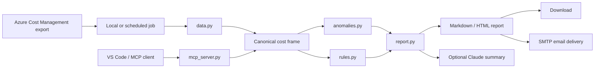

# FinOps Agent

## Prototype status
This project is a working prototype and proof of concept for intelligent FinOps reporting. It demonstrates the core workflow, deterministic rules, and optional AI narrative layer in a local environment. It is not yet a production Azure AI deployment.

For real implementation in Azure, the following Azure services and controls are required before this can be considered production-ready:

- Azure AI Foundry or Azure OpenAI for hosted model capability
- Azure Key Vault for secrets and certificates
- Managed Identity for Azure resource authentication
- Azure Storage or ADLS for input export files and output artifacts
- Azure Function, Container Apps, or a scheduled automation service
- Application Insights / Log Analytics for monitoring and diagnostics
- Azure RBAC and network isolation controls
- Secure mail delivery using a shared corporate mailbox or Microsoft Graph mail integration
- Formal approval for recipient allowlists and data handling

---

## Summary
The FinOps Agent is a local-first cost intelligence solution that turns Azure Cost Management exports into a deterministic, explainable cost review. It detects cost anomalies, ranks structural recommendations, produces a readable report, and can deliver the results by email to internal stakeholders.

This solution is designed to be transparent and auditable. Every cost number comes from deterministic Python rules. The model layer is used only for the narrative summary, never for the underlying arithmetic.

---

## Business problem
Finance and engineering teams often receive cost exports but do not know which spend changes matter. The FinOps Agent helps answer four operational questions:

- What changed unexpectedly in cloud spend?
- Which applications or services are driving the cost movement?
- What are the likely savings opportunities and operational risks?
- Which findings are worth acting on now, and which are noise?

---

## Product goals
- Detect anomalies with a defensible statistical model
- Highlight sustained step changes rather than one-off spikes
- Surface governance issues such as low tag coverage
- Produce a plain-language summary for engineering or finance stakeholders
- Keep the reporting process deterministic and explainable
- Support email delivery with a company-standard sender identity
- Run both locally and in scheduled production environments

---

## Solution overview
The FinOps Agent accepts Azure Cost Management CSV or TSV exports, standardizes the data, filters to the relevant business scope, calculates findings, renders a Markdown and HTML report, and optionally sends the output by email.

The system has two main layers:

1. Deterministic analysis layer
   - Data normalization and validation
   - Cost scope filtering
   - Anomaly detection
   - Recommendation generation
   - Report assembly

2. Optional AI narrative layer
   - Claude receives the already computed facts
   - Writes the summary paragraph only
   - Does not alter the calculations

---

## Key capabilities

### Anomaly detection
The agent detects and differentiates between:
- spikes
- step changes
- new spend
- stopped spend

This is done by comparing spend over time using robust statistical methods and multiple grains of analysis, including application, service, and application-service grouping.

### Recommendation engine
The recommendation layer scores issues such as:
- non-production spend not shut down on weekends
- unusual service growth
- low tag coverage
- meter concentration
- outliers relative to the estate baseline

Each recommendation is scored using deterministic factors for impact, confidence, effort, and risk.

### Report generation
The report combines:
- metrics and totals
- anomaly findings
- recommendation findings
- narrative summary
- HTML and Markdown outputs

If the AI model is unavailable, the report still renders with the deterministic findings intact.

---

## System architecture

### Main components
- app.py: local Streamlit dashboard
- run.py: CLI automation entry point
- data.py: data ingestion, column mapping, tag normalization
- anomalies.py: spend anomaly detection
- rules.py: recommendation generation and scoring
- report.py: facts assembly and narrative integration
- email_out.py: SMTP delivery layer
- config.py: thresholds and environment configuration
- mcp_server.py: read-only MCP adapter for tooling integrations

---

## Data flow
1. A cost export is uploaded or fetched from a configured source.
2. The adapter normalizes Azure or FOCUS-style column names.
3. The business scope is applied to filter the relevant cost lines.
4. Anomaly detection runs on the filtered dataset.
5. Recommendations are computed using deterministic scoring rules.
6. A facts object is assembled with the verified numbers.
7. The narrative model receives the facts and produces the summary text.
8. Reports are rendered and optionally emailed.

---

## Production deployment model
For production, this app is best deployed as a scheduled job or containerized automation process that runs after the cloud export has landed.

### Actual Azure AI implementation items required
To deploy this as a real Azure AI-backed service, the following production components are required:

- Azure AI Foundry project or Azure OpenAI resource with a supported model deployment
- Azure OpenAI model deployment for summarization or assistant-style analysis
- Azure Key Vault for storing keys, secrets, and connection strings
- Managed Identity enabled on the app or hosting service
- Azure Storage account or ADLS Gen2 for cost exports and generated reports
- Azure Function App, Azure Container Apps, or equivalent scheduled compute host
- Azure RBAC roles for Storage, Key Vault, and monitoring access
- Application Insights and Log Analytics for telemetry, failures, and alerting
- Azure Monitor or Action Groups for job failure alerts
- Data retention, encryption, and private networking configuration
- A company-approved email integration via Microsoft Graph or an internal Exchange SMTP relay
- A recipient allowlist and internal-domain enforcement for mail delivery
- A formal data classification and privacy review for any cost or employee-related metadata

### Recommended production deployment
- Azure Storage Blob or ADLS export is the input source
- A daily or early-week scheduled job reads the newest export
- The job applies business scope and threshold logic
- The report is rendered as Markdown/HTML and stored as an artifact
- A managed email sender sends the report to approved internal recipients

### Recommended operational controls
- Use a dedicated FinOps mailbox as the `From` address
- Limit recipients to internal company domains or approved distribution lists
- Use a managed identity or secret store instead of personal credentials
- Keep a stale-data threshold for production usage if desired
- Log source metadata, file age, and delivery status without logging content

---

## Security and governance
The solution is designed to be operationally safe and transparent.

- The Python layer owns the actual cost arithmetic and ranking logic
- The AI model only summarises the final numbers
- Email does not allow arbitrary outbound sending
- Internal-only recipients should be enforced in production
- Secrets should live in a secure secret store, not in source control
- The execution model is read-only with respect to Azure resources

---

## Email architecture
The project supports a traditional SMTP mail flow for local and controlled internal deployment.

### Production email pattern
- Sender: shared FinOps mailbox such as `finops-reports@company.com`
- Recipients: internal team aliases or approved distribution groups
- SMTP host: Exchange or Microsoft 365 SMTP endpoint
- Auth: dedicated service account, shared mailbox, or managed identity-based mail integration

### Recommended mail policy
- Only company email domains are allowed
- No personal inboxes in production
- Approval process for adding new recipients
- Audit trail for each delivery

---

## Risks and limitations
- Without utilisation data, the tool cannot identify idle compute perfectly
- Without Advisor integration, it cannot merge provider recommendations
- Savings estimates are directional and should be validated by owners
- The weekly cadence depends on the export being complete and timely
- The model summary should be treated as a communication aid, not a source of truth

---

## Success criteria
The FinOps Agent is successful when:
- the team trusts the detection logic and the data freshness checks
- the report clearly identifies material cost changes
- internal stakeholders can review the output quickly
- the send-to-email flow is safe and controlled in production
- the architecture remains simple, explainable, and auditable

---

## Ownership
This project should be owned by the team responsible for cloud cost governance, platform operations, and engineering visibility. It is a reporting and decision-support tool, not a direct control plane for cloud spend.

---

## Relevant files
- README.md
- ARCHITECTURE.md
- app.py
- report.py
- anomalies.py
- rules.py
- config.py
- email_out.py
- mcp_server.py

This Confluence page is intended as a stakeholder-facing summary and deployment overview for the project team.
